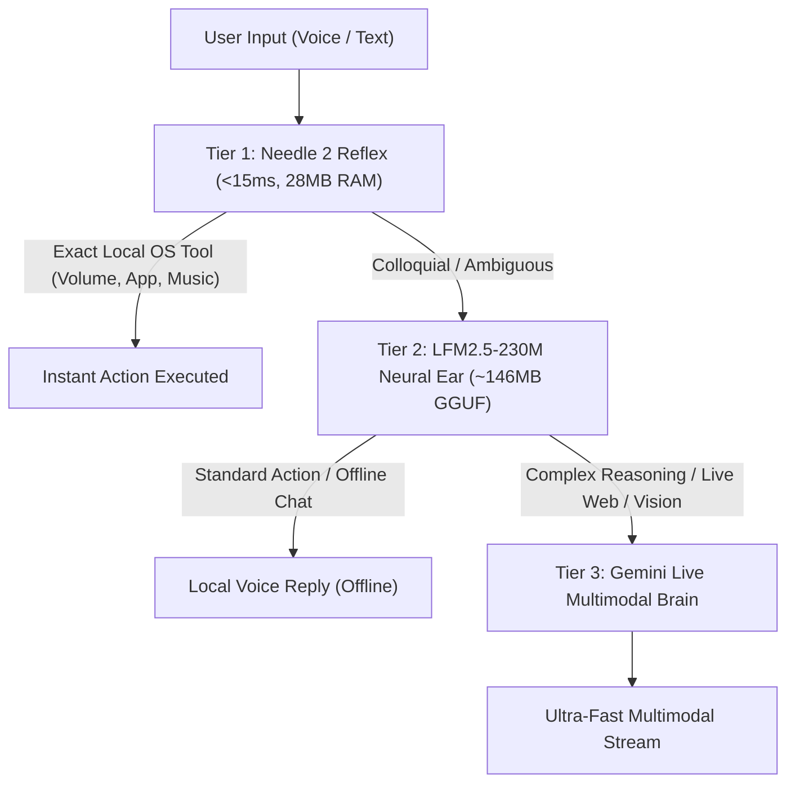

# 📖 J.A.R.V.I.S. (Mark LIII) — Complete User Control Guide & Feature Manual
> **SudhirDevOps1 AI Assistant** • *Autonomous, Multi-Modal, Tri-Tier Neural Desktop Interface*

---

## 📑 Table of Contents
1. [Master Control Channels (Kaise Control Karein)](#1-master-control-channels-kaise-control-karein)
   - [🎤 Voice & Speech Input](#-voice--speech-input)
   - [⌨️ Text Chat & Desktop GUI](#️-text-chat--desktop-gui)
   - [⚡ Keyboard Shortcuts & Hotkeys](#-keyboard-shortcuts--hotkeys)
   - [📱 Remote Phone & Web Dashboard](#-remote-phone--web-dashboard)
   - [🎭 Persona Modes](#-persona-modes-maya-ji-jarvis-teacher-devops)
2. [Language & Verb Family Guide (Bhasha Aur Bolchaal)](#2-language--verb-family-guide-bhasha-aur-bolchaal)
   - [देखना (Dekhna) — Visual Inspection](#1-देखना-dekhna--visual-perception)
   - [सुनना (Sunna) — Auditory & Media](#2-सुनना-sunna--auditory-playback)
   - [बोलना (Bolna) — Conversation & Tone](#3-बोलना-bolna--conversational-flow)
   - [चलना (Chalna) — Execution & Status](#4-चलना-chalna--execution--telemetry)
   - [करना (Karna) — Productivity & Tasks](#5-करना-karna--productivity--tasks)
3. [All Features & Commands by Category](#3-all-features--commands-by-category)
   - [🎛️ 1. System, Hardware & OS Control](#1-system-hardware--os-control)
   - [🚀 2. Application Launcher & Windows Management](#2-application-launcher--windows-management)
   - [🎵 3. Music, Audio & Video (Offline Scanner + YouTube)](#3-music-audio--video)
   - [🌐 4. Web Search, Research & Live Information](#4-web-search-research--live-information)
   - [👁️ 5. Vision, Screen Troubleshooter & Camera AI](#5-vision-screen-troubleshooter--camera-ai)
   - [🤖 6. Autonomous Agent Mode & Multi-Step Goals](#6-autonomous-agent-mode--multi-step-goals)
   - [📝 7. Memory, Notes, Reminders & Alarms (TinyDB + Obsidian)](#7-memory-notes-reminders--alarms)
   - [💡 8. Smart Home & IoT Automation (Tuya)](#8-smart-home--iot-automation)
   - [💻 9. Developer, Terminal & DevOps Tools](#9-developer-terminal--devops-tools)
   - [💬 10. Messaging & Communication (Telegram, WhatsApp, Slack)](#10-messaging--communication)
   - [🧩 11. Active Plugins (Google Workspace, Notion, Stocks, etc.)](#11-active-plugins)
   - [🛡️ 12. Privacy Shield, Blacklist & Security](#12-privacy-shield--security)
4. [Tri-Tier Edge AI Architecture (Offline vs Cloud)](#4-tri-tier-edge-ai-architecture)
5. [Troubleshooting & Pro Tips](#5-troubleshooting--pro-tips)

---

## 1. Master Control Channels (Kaise Control Karein)

J.A.R.V.I.S. ko aap **4 alag-alag tarikon** se control kar sakte hain:

### 🎤 Voice & Speech Input
- **Real-Time Live Voice**: Mic on hote hi aap seedha bol sakte hain. J.A.R.V.I.S. ultra-low latency (<200ms) me native voice se reply karega.
- **Wake Word ("Hey Jarvis")**: Setting me enable karke hands-free kahiye *"Hey Jarvis"* aur computer aapse baat karne lagega.
- **Microphone Toggle**: Screen par Mic button ya **F4** dabakar mic mute/unmute karein.

### ⌨️ Text Chat & Desktop GUI
- **HUD Interface**: J.A.R.V.I.S. ke holographic HUD ke bottom me chat input box hai. Koi bhi command type karein aur `Enter` dabayein.
- **Instant Response**: Text commands local Needle 2 reflex aur LLM engine se process hoti hain.

### ⚡ Keyboard Shortcuts & Hotkeys
| Shortcut | Action | Description |
| :--- | :--- | :--- |
| `Ctrl + Space` | **Global Summon** | Poore Windows me kahi se bhi J.A.R.V.I.S. ko samne lane ke liye. |
| `Escape` | **Instant Interrupt** | J.A.R.V.I.S. bol raha ho toh use turant chup karane ke liye. |
| `F4` | **Mute / Unmute** | Microphone on/off toggle karne ke liye. |
| `F11` | **Fullscreen HUD** | Sci-Fi Holographic full-screen mode toggle. |

### 📱 Remote Phone & Web Dashboard
- **Mobile Control**: J.A.R.V.I.S. aapke local Wi-Fi par ek web server run karta hai (Default: `http://<your-pc-ip>:8000`).
- **QR Code Auto-Login**: J.A.R.V.I.S. UI me **"Remote Control"** button dabayein, phone camera se QR scan karein aur phone se poora PC control karein:
  - Phone se voice command bhejna.
  - PC volume, brightness, apps control karna.
  - Live activity feed dekhna.

### 🎭 Persona Modes (Maya Ji, JARVIS, Teacher, DevOps)
Voice ya text se mode switch karein:
- **Maya Ji (Companion)**: *"Maya ji mode lagao"* ya *"girlfriend mode"* — Warm, caring, affectionate Hinglish friend.
- **JARVIS**: *"Jarvis mode lagao"* — Sophisticated, witty, Tony Stark style AI butler.
- **Teacher**: *"Teacher mode on karo"* — Explains concepts patiently with examples.
- **DevOps / Engineer**: *"DevOps mode lagao"* — Direct, technical, terminal-focused.

---

## 2. Language & Verb Family Guide (Bhasha Aur Bolchaal)

J.A.R.V.I.S. **Hindi (हिंदी), Hinglish (हिंग्लिश), aur English** teeno bhashaon ko naturally samajhta hai. Desi bolchaal ke 5 mukhya kriya parivaar (Verb Families):

### 1. देखना (Dekhna) — Visual Perception
| Command (Hindi / Hinglish / English) | Action Executed |
| :--- | :--- |
| *"Screen dekho aur batao kya khula hai"* | Screen troubleshoot & visual inspection |
| *"Code me error dekho"* | Inspects code window for errors |
| *"Camera se dekho mere haath me kya hai"* | Opens camera and inspects physical object |
| *"Screen ka photo lo"* / *"Screenshot le lo"* | Captures screenshot to `screenshots/` |
| *"What's on my screen right now?"* | Full screen OCR & context analysis |

### 2. सुनना (Sunna) — Auditory Playback
| Command (Hindi / Hinglish / English) | Action Executed |
| :--- | :--- |
| *"Arijit Singh ka gaana sunao"* | Offline library ya YouTube par gaana bajana |
| *"Meri aawaz sun rahe ho kya?"* | Confirms mic audibility & responsiveness |
| *"Aawaz thodi badhao"* / *"Volume kam karo"* | Adjusts system master volume |
| *"Koi accha sa chutkula sunao"* | Tells a funny joke in persona tone |
| *"Shayari sunao"* / *"Kahani sunao"* | Recites shayari or short story |

### 3. बोलना (Bolna) — Conversational Flow
| Command (Hindi / Hinglish / English) | Action Executed |
| :--- | :--- |
| *"Aur batao"* / *"Aage bolo"* | Natural conversation continuation |
| *"Chup ho jao"* / *"Aawaz band karo"* | Mutes speech immediately |
| *"Hindi me samjhao"* / *"English me bolo"* | Switches response language dialect |
| *"Aasan bhasha me batao"* | Simplifies explanation for beginners |

### 4. चलना (Chalna) — Execution & Telemetry
| Command (Hindi / Hinglish / English) | Action Executed |
| :--- | :--- |
| *"Chrome chalao"* / *"Brave open karo"* | Launches application instantly |
| *"Computer me kya chal raha hai?"* | Lists all active background processes |
| *"Internet chal raha hai ya nahi?"* | Checks real-time network latency & ping |
| *"Delhi kaise jaye?"* / *"Patna ki train"* | Opens travel transit route comparison |

### 5. करना (Karna) — Productivity & Tasks
| Command (Hindi / Hinglish / English) | Action Executed |
| :--- | :--- |
| *"Yaad rakhna kal 10 baje meeting hai"* | Stores note into local TinyDB memory |
| *"Storage check karo"* / *"Space kitna bacha hai?"* | Checks C: and D: drive storage |
| *"Obsidian me daily note add karo"* | Appends markdown entry to Obsidian vault |
| *"Trip plan karo Goa ke liye"* | Activates multi-step Autonomous Agent |

---

## 3. All Features & Commands by Category

---

### 🎛️ 1. System, Hardware & OS Control
Aapke computer ka poora hardware control:
- **Volume**:
  - *"Volume 50% kar do"*
  - *"Volume badhao"* / *"Awaaz kam karo"*
  - *"Mute kar do"* / *"Unmute karo"*
- **Brightness**:
  - *"Brightness 80% karo"*
  - *"Screen brightness kam karo"*
- **Power Operations**:
  - *"PC lock kar do"* (`Win+L`)
  - *"Computer sleep par daalo"*
  - *"System shutdown karo"* (Confirmation maangta hai)
  - *"PC restart karo"*
- **Storage & Telemetry**:
  - *"Storage check karo"* (Total, Used, Free Space in GB)
  - *"Battery status batao"* (Percentage & Charging state)
  - *"RAM usage kitna hai?"* / *"CPU kitna load le raha hai?"*
- **Clipboard & Screenshots**:
  - *"Screenshot lo"* / *"Screen capture karo"*
  - *"Clipboard me kya copy hai?"*

---

### 🚀 2. Application Launcher & Windows Management
Host PC ke 300+ apps ko bina rukaawat launch aur manage karein:
- **Open Apps**:
  - *"Notepad kholo"*, *"VS Code chalao"*, *"Calculator open karo"*
  - *"Spotify open karo"*, *"Steam launch karo"*, *"Photoshop kholo"*
- **Window Management**:
  - *"Chrome ko minimize kar do"*
  - *"Notepad maximize karo"*
  - *"Sabhi windows minimize kar do"* (Show Desktop)
  - *"Brave ko samne lao"* (Focus window)
  - *"Calculator band karo"* (Close window)
- **Running Task Inspection**:
  - *"Kaun se apps chal rahe hain?"*
  - *"Background tasks dikhao"*

---

### 🎵 3. Music, Audio & Video
Universal drive audio scanner + YouTube fallback:
- **Offline High-Speed Music (0 Network, 0ms Lag)**:
  - *"Gaana chalao [Song Name]"* (e.g. *"Kesariya gaana chalao"*)
  - PC ke sabhi drives (`C:`, `D:`, `E:`) me fuzzy token search karke background me play karta hai bina kisi browser popup ke.
  - *"Library rescan karo"* — PC ke naye download kiye hue gaano ko re-index karta hai.
- **YouTube Video Streaming**:
  - *"Apna college ka Python video lagao"*
  - *"YouTube par funny cat videos chalao"*
  - Direct video mode me browser tab me HD playback start karta hai.
- **Playback Controls**:
  - *"Gaana pause karo"* / *"Video roko"*
  - *"Resume karo"* / *"Aage badhao"*

---

### 🌐 4. Web Search, Research & Live Information
- **Instant Web Search**:
  - *"Aaj ki taaza khabrein kya hain?"*
  - *"Nifty 50 aaj kitna upar hai?"*
  - DuckDuckGo / Google Search ke real-time snippets summarize karta hai.
- **Deep Research Mode**:
  - *"Deep research karo Quantum Computing par"*
  - Multi-page scraper, academic papers aur reference citations ke saath summary banata hai.
- **Live Weather**:
  - *"Mausam kaisa hai?"*
  - *"Delhi me barish hogi kya aaj?"*
  - Temperature, humidity, air quality index aur wind speed report karta hai.
- **E-Commerce Price Comparison**:
  - *"Amazon par best wireless headphones search karo"*

---

### 👁️ 5. Vision, Screen Troubleshooter & Camera AI
- **Screen TroubleShooter**:
  - *"Screen dekho aur error samjhao"*
  - High-resolution screen capture karta hai, code bug, console traceback ya dialog box read karke solution batata hai.
- **Camera Vision (Physical Reality)**:
  - *"Camera chalu karo"*
  - *"Camera se dekho yeh kaun si dawai hai?"*
  - *"Mere haath me jo kitaab hai uska title batao"*
  - Webcam stream ko analyse karke object, face, aur physical world explain karta hai.
  - *"Camera band karo"* — Webcam safely release karta hai.
- **OCR Text Extraction**:
  - *"Screen par jo text dikh raha hai use copy kar lo"*

---

### 🤖 6. Autonomous Agent Mode & Multi-Step Goals
J.A.R.V.I.S. sirf ek sawaal ka jawab nahi deta, balki complex goals ko autonomous steps me tod kar execute karta hai:
- **Command Structure**:
  - *"Agent mode: Goa trip plan karo"*
  - *"Trip plan karo: Flight search karo, weather dekho, packing list banao aur Telegram par bhejo"*
- **How It Works**:
  1. Goal ko 3-5 action steps me break karta hai.
  2. Step 1 (Flight Finder), Step 2 (Web Search), Step 3 (Reminder), Step 4 (Send Message) execute karta hai.
  3. Progress `config/todos.json` aur UI live checklist me real-time update karta hai.
- **Status & Review**:
  - *"Agent status dikhao"* — Active goals ka progress batata hai.
  - *"Agent cancel karo"* — Background running swarm ko abort karta hai.

---

### 📝 7. Memory, Notes, Reminders & Alarms
- **TinyDB Quick Memory**:
  - *"Yaad rakhna mera Wi-Fi password Stark@2026 hai"*
  - *"Mera Wi-Fi password kya tha?"*
  - *"Mera blood group yaad rakhna O positive"*
- **Smart Reminders**:
  - *"Sham ko 5 baje chai peene ka reminder lagao"*
  - *"Kal subah 9 baje meeting ka reminder set karo"*
  - *"Reminders dikhao"* / *"Reminders clear karo"*
- **Obsidian Brain Sync**:
  - *"Obsidian me note banao Project Roadmap"*
  - *"Daily note me likho: Completed sprint review"*
  - *"Obsidian me search karo Docker commands"*
- **Clock & Alarms**:
  - *"Abhi kya samay ho raha hai?"*
  - *"Subah 6 baje ka alarm lagao"*

---

### 💡 8. Smart Home & IoT Automation
Tuya / Smart Life smart bulbs, switches aur plugs:
- **Lighting Controls**:
  - *"Bedroom light on karo"* / *"Light band kar do"*
  - *"Light ka color blue kar do"*
  - *"Brightness 50% par set karo"*
- **Setup**: `config/smart_home.json` me Device ID aur Local Key enter karein (Local LAN control bina internet delay ke).

---

### 💻 9. Developer, Terminal & DevOps Tools
Software engineers ke liye powerful automated actions:
- **Terminal Execution (Safe Mode)**:
  - *"Run command: git status"*
  - *"Run command: docker ps"*
- **Code Helper & Bug Fixer**:
  - *"Yeh Python code optimize karo"*
  - *"Is SQL query ka execution plan explain karo"*
- **API Sniffer & Network Inspector**:
  - *"Web network traffic sniff karo"* — Browser ke internal XHR/Fetch API endpoints analyze karta hai.
- **Dev Agent & Swarm**:
  - Multi-agent swarm spawn karke project structure audit aur unit testing chala sakta hai.

---

### 💬 10. Messaging & Communication
- **Telegram**:
  - *"Telegram par Ritik ko message bhejo: Main 10 minute me pahunch raha hoon"*
- **WhatsApp Web Automation**:
  - *"WhatsApp par Mummy ko message karo: Good morning"*
- **Slack (Workspace Integration)**:
  - *"Slack ke general channel me update post karo: Release v1.3.0 deployed"*

---

### 🧩 11. Active Plugins
J.A.R.V.I.S. plug-and-play architecture par chalta hai (`plugins/` directory):
1. **`calendar_tool`**: *"Google Calendar par kal 3 baje interview schedule karo"*
2. **`gmail_tool`**: *"Naye unread emails check karo"*
3. **`drive_tool`**: *"Google Drive me resume search karo"*
4. **`notion_sync`**: *"Notion page me task sync karo"*
5. **`pomodoro_timer`**: *"25 minute ka focus timer chalao"*
6. **`spotify_control`**: *"Spotify par lofi playlist play karo"*
7. **`stock_price`**: *"Tata Motors aur Reliance ka stock price batao"*
8. **`slack_tool`**: Channel communication and alert dispatch
9. **`smart_home`**: Tuya local IoT control
10. **`github_tool`**: PR review, open issues list, and repo health checks

---

### 🛡️ 12. Privacy Shield & Security
- **Local Shielding**:
  - Netbanking, UPI, passwords, password manager apps (`Bitwarden`, `1Password`) screen par open hone par auto-shield trigger hota hai.
  - Sensitive windows ka screenshot lena ya video stream karna block ho jaata hai.
- **Zero Cloud Leak**:
  - API keys machine-bound DPAPI encryption ke sath local `.machine.key` se encrypted rehti hain.
  - Personal session history (`journals/`, `tinydb_store.json`) `.gitignore` me protected rehti hai.

---

## 4. Tri-Tier Edge AI Architecture

J.A.R.V.I.S. 3 layers me sochta aur execute karta hai:

1. **Tier 1 — Needle 2 Reflex (28MB RAM, <15ms)**:
   - Volume, apps kholna, screenshot lena, time dekhna — zero API call, zero network, instant execution.
2. **Tier 2 — LFM2.5-230M Neural Ear (146MB GGUF, On-Device)**:
   - Hindi colloquial speech normalization aur internet band hone par local offline conversational responses.
3. **Tier 3 — Gemini Live & Cloud LLMs**:
   - Complex reasoning, deep research, coding aur multi-modal vision tasks.

---

## 5. Troubleshooting & Pro Tips

- **Aawaz nahi sun raha?**
  - Press `F4` — check karein screen par `🔇 MICROPHONE MUTED` toh nahi likha.
- **Camera nahi open ho raha?**
  - Check karein koi dusra app (Zoom/Teams) webcam use na kar raha ho. Bolo: *"Camera band karo"* phir *"Camera kholo"*.
- **Offline songs play nahi ho rahe?**
  - Bolo: *"Songs rescan karo"* ya *"Music library refresh karo"*. J.A.R.V.I.S. aapke saare PC drives me `.mp3`, `.wav`, `.m4a` files dubara dhoondh lega.
- **Double click start nahi ho raha?**
  - `start_jarvis.bat` par double click karein. Script automatic Python check karegi aur packages install kar degi.
- **Interrupt karna hai?**
  - Bolte hue beech me rokne ke liye keyboard par **`Escape`** dabayein.

---

*Enjoy building the future with SudhirDevOps1 J.A.R.V.I.S.!*
